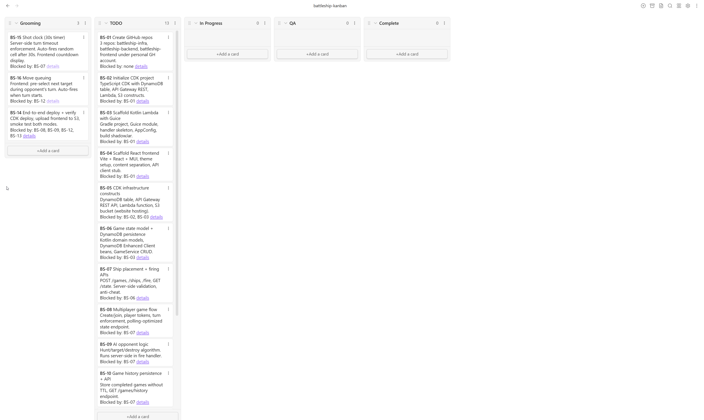
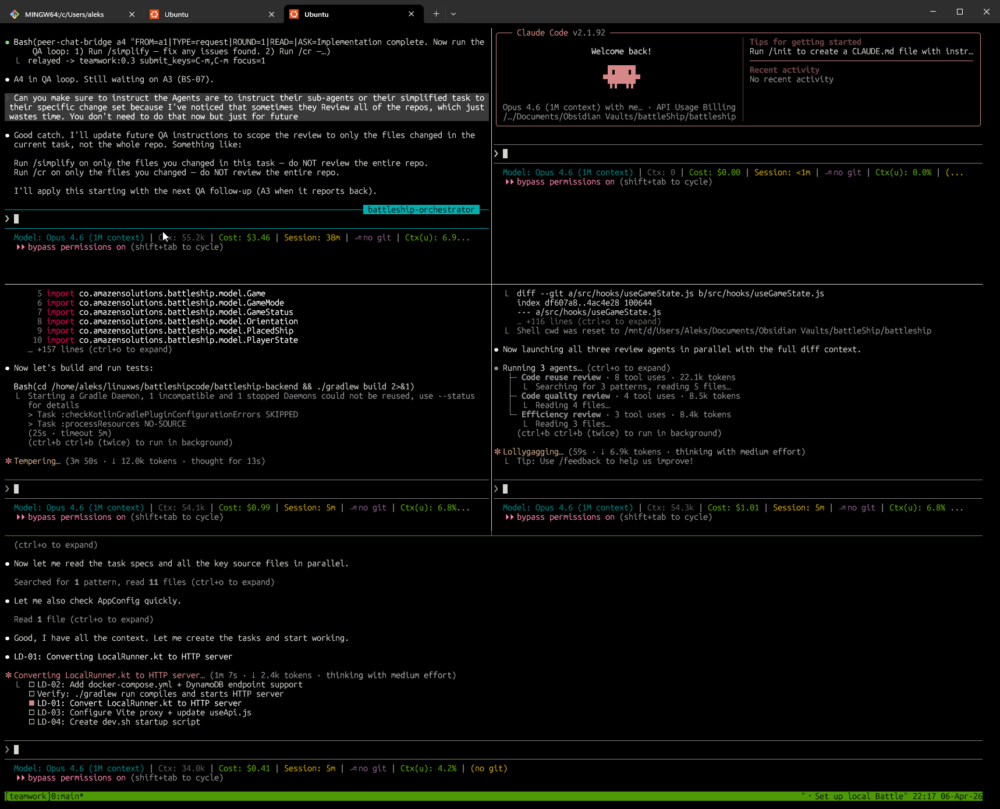
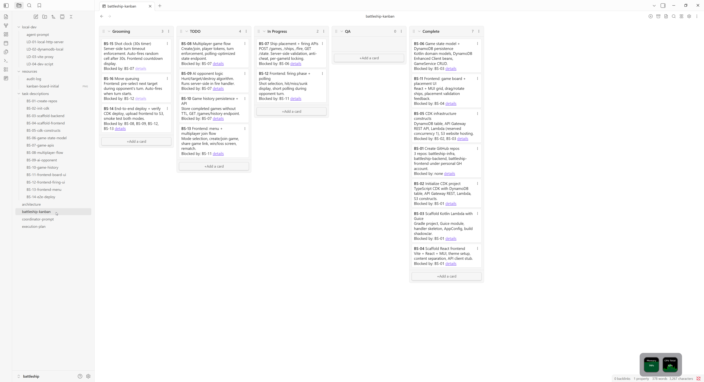
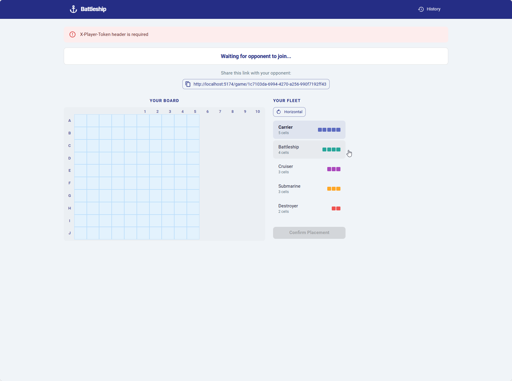
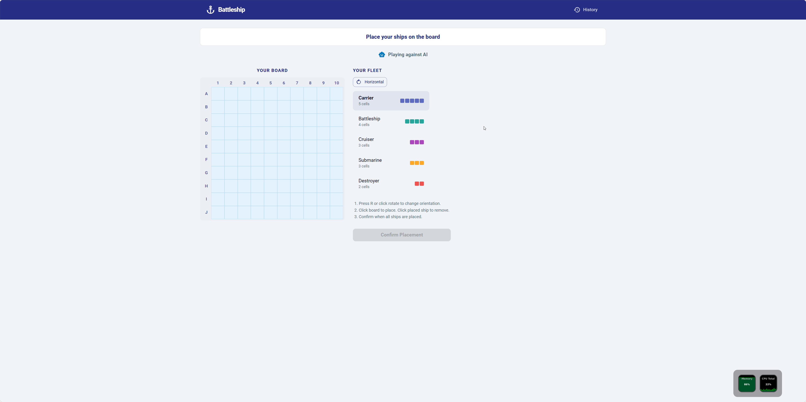

# Battleship — Audit Log

## Phase 0: Planning & Scaffolding (2026-04-06)

### Approach

Before writing any game logic, we invested ~45 minutes in architecture, task design, and quality gates. The goal: set up enough structure that 3 parallel AI agents can implement features independently without stepping on each other or producing inconsistent code.

### What We Built

**Architecture & task breakdown:**
- Explored 3 reference projects in parallel (CDK patterns, Kotlin Lambda patterns, React+MUI patterns) to establish conventions
- Made 8 architectural decisions through structured tradeoff analysis — short polling over WebSocket (free tier), raw Lambda handlers over Ktor (cold starts), Guice DI, S3 website hosting over CloudFront, etc.
- Decomposed the project into 16 tasks with explicit dependency chains, organized on an Obsidian Kanban board
- Designed a 4-wave parallelization plan mapping tasks to agents by repo

**3 repos scaffolded in parallel** (~8 min wall time for all 3):
- `battleship-infra`: CDK TypeScript with construct skeletons, stage config, `cdk synth` passing
- `battleship-backend`: Kotlin/Gradle with Guice DI, domain models, API routing, placement/firing services, Shadow JAR building clean (27 files)
- `battleship-frontend`: React 19 + MUI 7 + Vite with all pages, components, hooks, navy theme, production build at 150KB gzipped (22 files)

**Rules audit before implementation:**
Ran a systematic audit of all `.claude/rules/` files. Found 14 issues — missing CORS headers, no multiplayer model spec, Gson deserialization gotcha, incomplete placement validation, no data boundary rules. All fixed before any implementation agent touches the code. This prevents the same bug from appearing in multiple agents' output.

**Coordinator workflow designed:**
Created a coordinator prompt that manages 3 worker agents (one per repo, never two on the same repo). Workers implement → run `/simplify` + `/cr` QA loop → coordinator reports to user → user signs off before next assignment. All inter-agent communication via `/peer-chat-bridge`.

### Iteration Highlights

The plan wasn't right on the first pass. Key refinements:
- **WebSocket → short polling:** Identified API Gateway WebSocket API isn't free tier. Pivoted to 1.5s polling — fine for turn-based gameplay.
- **CloudFront → S3 website hosting:** CloudFront adds CDK complexity (OAC, cache invalidation, 15-min distribution creation) for zero benefit on a demo.
- **Monorepo → separate repos:** User preference for consistency with existing team conventions.
- **Code location:** Repos initially created inside the Obsidian vault symlink (Windows FS). Relocated to `/home/aleks/linuxws/battleshipcode/` for native Linux FS performance.
- **Agent constraints tightened:** Reduced from 4 agents to 3 (one per repo, no exceptions). Added user sign-off gate after QA loop — coordinator can't auto-advance.

### State After Phase 0

4 of 16 tasks complete (BS-01 through BS-04). 9 tasks in TODO with dependencies mapped. 3 in grooming. All rules files in place. Ready for implementation waves.

#### Board after P0

---

## Phase 1: Wave 2 Implementation + Local Dev (2026-04-06)

### Edge Case Review

Before kicking off implementation, brainstormed attack vectors and edge cases:
- **Token security:** Player tokens are server-generated UUIDs, returned once, never echoed in state responses. No escalation path even if gameId is known.
- **Page refresh:** Token persists in sessionStorage, gameId in URL — game resumes seamlessly.
- **Concurrent fire race condition:** Solved with reserved Lambda concurrency of 1 + in-memory `ReentrantLock` per gameId. Avoids DynamoDB conditional write complexity for demo scope (ADR-09).
- **Max board size:** DynamoDB 400KB item limit supports boards up to ~140x140. Beyond that, fundamentally different storage model needed.

### Implementation Kickoff

Coordinator delegated 3 Wave 2 tasks to workers in parallel (one per repo):
- **BS-05** (infra) — CDK constructs: DynamoDB, API Gateway, Lambda (reserved concurrency 1), S3 website hosting
- **BS-06** (backend) — Game state model, domain classes, DynamoDB persistence with Enhanced Client
- **BS-11** (frontend) — Game board UI, ship placement with drag/rotate

All three agents completed and passed QA. BS-06 and BS-05 moved to Complete. BS-07 and BS-12 now in progress (Wave 3).

### Local Dev Agent

Spun up a 4th parallel agent to make the stack locally testable while implementation continues. Zero file conflicts with Wave 2/3 workers — touches only `LocalRunner.kt`, `BattleshipModule.kt`, `vite.config.js`, and new files. Four tasks:
1. Convert `LocalRunner.kt` from single-event invocation to JDK `HttpServer` on port 3000
2. DynamoDB Local via Docker Compose + table creation script
3. Vite dev proxy (`/games/**` → `localhost:3000`)
4. `dev.sh` startup script

### Current State

5 agents running concurrently — 3 on implementation (coordinator + 2 workers on BS-07, BS-12), 1 on local dev setup, 1 brainstorming with the user.

#### Board during Wave 2

#### Local stack running

---

## Phase 2: Bug Fixes & Polish (2026-04-07)

### Compatibility Fixes

Local testing revealed 13 API contract mismatches between frontend and backend — agents built against different assumptions for field names, enum values, body shapes, and response structures. Cataloged all 13 in a single compatibility document, then resolved via two tickets:
- **BS-20** (backend) — Added `updatedAt` to state response, normalized `winnerId` format across endpoints
- **BS-19** (frontend) — Adapter layer translating all outgoing requests and incoming responses in one module

### Security Hardening

- Removed unauthenticated `DELETE /games/{id}` endpoint — games clean up via TTL, no manual deletion needed
- Added spectator mode to `GET /state` — no-token requests get a read-only view (ships hidden during play, revealed after completion)
- Verified all mutating endpoints validate `X-Player-Token`

### UI Polish

- **BS-17** — Reworked placement controls: rotate button + R key, click-to-remove placed ships, fixed vertical placement on right edge
- **BS-18** — Fixed board grid alignment (column headers, row labels), resolved X-Player-Token error on waiting screen
- Placement instructions added to guide new players

### AI Opponent (BS-09)

Hunt/target/destroy algorithm implemented. Checkerboard pattern for hunt mode, adjacent probing on hit, line-following on confirmed direction. AI places ships at game creation and fires immediately after the player's turn.

### Remaining Work

- **BS-10** (game history) — scan with COMPLETED filter, 7-day TTL
- **BS-14** (e2e deploy) — final deployment and smoke test

#### Polished placement UI

